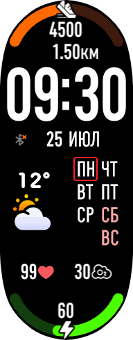
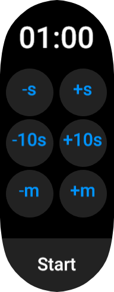
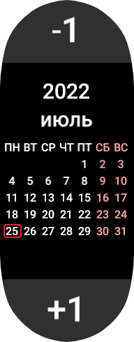

# Приложения для часов Mi Band 7

   

Набор моих ZeppOS-приложений и циферблата для Xiaomi Mi Band 7.

## Что здесь лежит

| Папка | Что это |
| --- | --- |
| `watchface` | основной кастомный циферблат: время, дата, день недели, батарея, погода, шаги, дистанция, пульс, SpO2 и прогресс активного таймера |
| `timer` | отдельное приложение таймера с произвольным временем, вибрацией и экраном сработавшего таймера |
| `timer_presets` | приложение с быстрыми пресетами таймеров; запускает `timer` с выбранным временем |
| `calendar` | простой календарь по месяцам с подсветкой сегодняшнего дня |

## Сборка

Сборка делается через [ZMake](https://github.com/melianmiko/zmake) от melianmiko. `zmake` принимает путь к папке проекта, в которой лежит `app.json`, конвертирует картинки в формат часов, складывает подготовленные файлы в `build/` и делает установочный `bin` в `dist/`.

```bash
zmake.exe watchface
zmake.exe timer
zmake.exe timer_presets
zmake.exe calendar
```

Для Mi Band 7 в `zmake.json` важен `encode_mode: "dialog"` и `package_extension: "bin"`. Сгенерированные `build/` и `dist/` не коммитятся: они перечислены в `.gitignore` внутри каждого проекта.

## Как скинуть на часы с телефона

Самый простой Android-способ - приложение [Mi Band 7 Watch Faces](https://play.google.com/store/apps/details?id=asn.ark.miband7). В гайдах оно часто называется просто MiBand7. Несмотря на текст "watch face", через него ставятся и циферблаты, и приложения.

1. Скопировать нужный `.bin` на телефон: через USB, Telegram, Google Drive, Syncthing или любым другим способом.
2. Открыть Zepp Life / Mi Fitness и убедиться, что браслет подключен и синхронизирован.
3. Открыть Mi Band 7 Watch Faces.
4. Нажать нижнюю кнопку меню.
5. Выбрать `Install your watch face`.
6. Нажать `Choose BIN-file` и выбрать собранный `.bin`.
7. Нажать `Add watch face`.
8. Выбрать recommended install method, затем свой браслет и `Set watch face`.
9. Дождаться окончания передачи.

Если устанавливалось приложение, оно появится в меню приложений на часах. Если устанавливался `watchface.bin`, он появится как циферблат. Кастомные приложения на Mi Band 7 не работают в фоне, не имеют доступа к телефону/интернету и иногда могут открываться с жёлтым экраном `OK`; обычно помогает закрыть и открыть приложение заново. Для удаления кастомных приложений можно поставить [ZeppOS Toolbox](https://github.com/melianmiko/ZeppOS-Toolbox).

Подробный гайд по установке: <https://mmk.pw/en/posts/sb7-install-guide/>.
